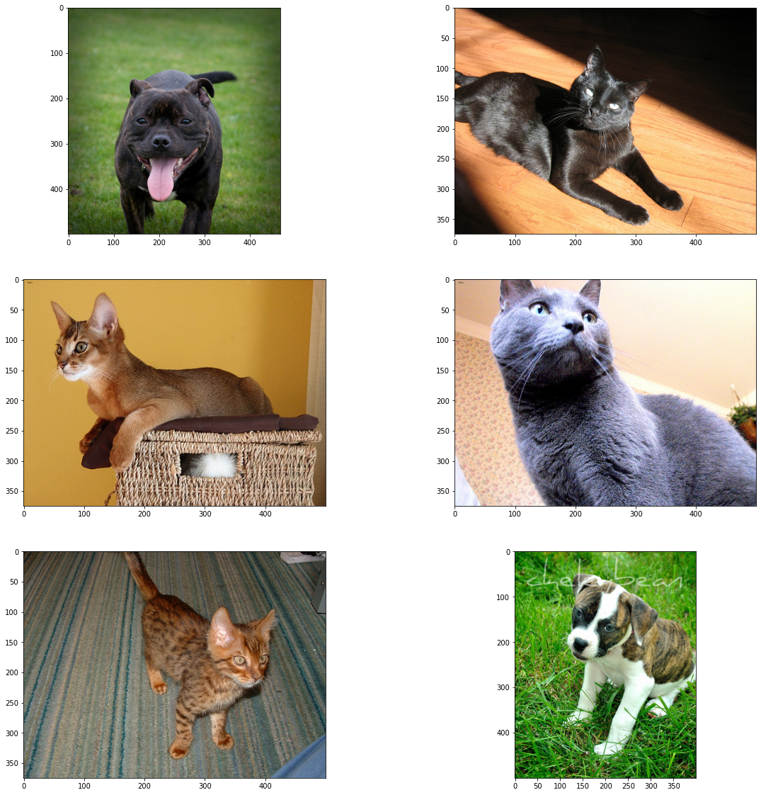
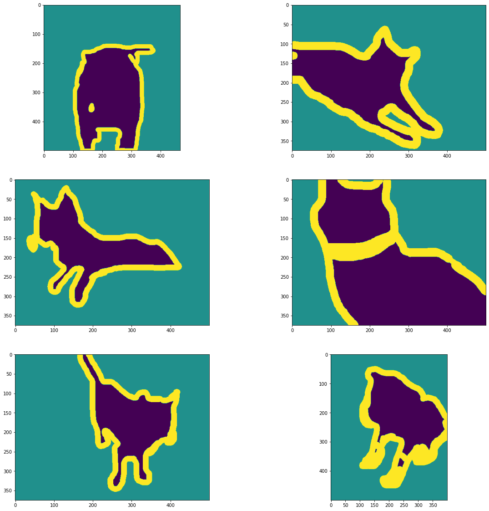
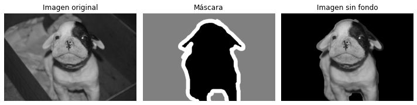

# Breed Recognizer

 El objetivo de este proyecto es extraer las características principales de las razas de perros y gatos a partir de imágenes y utilizar estas características para diferenciar entre distintas razas. Además, se busca indicar a qué raza o razas se parece más el animal después del procesamiento de la imagen.

## Características del proyecto

- El proyecto se enfoca en la identificación de razas de perros y gatos a partir de imágenes.
- Se utilizan técnicas de procesamiento de imágenes para extraer características relevantes.
- Se emplea aprendizaje automático y algoritmos de clasificación para diferenciar entre distintas razas.
- Se busca proporcionar una indicación de la raza o razas a las que se parece más el animal en la imagen procesada.

## Dataset utilizado

Se utilizó el [ The Oxford-IIIT Pet Dataset](https://www.robots.ox.ac.uk/~vgg/data/pets/) que consta de 37 categorías de mascotas con aproximadamente 200 imágenes para cada clase. Las imágenes presentan variaciones significativas en escala, pose e iluminación. Cada imagen cuenta con una anotación de la raza correspondiente, una región de interés (ROI) para la cabeza y una segmentación del background.

A continuación se muestran ejemplos de imágenes del dataset y sus correspondientes etiquetas de segmentacion:

Ejemplo de imagen con el fondo removido:

