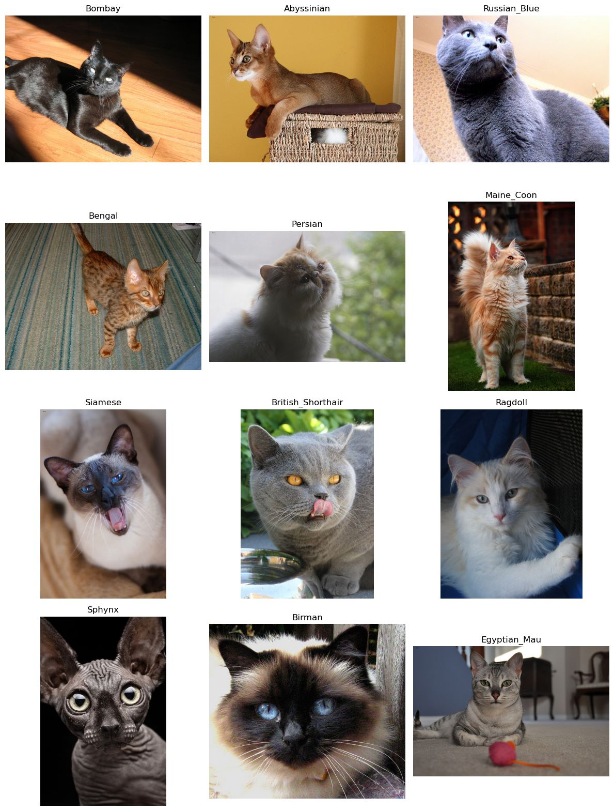

# TIMAG 2023 - PROYECTO FINAL - Grupo 4
# Breed Recognizer

[Página web del proyecto](https://maria.victoria.tournier.pages.fing.edu.uy/breed-recognizer-timag/pages/introduccion.html)

[Repositorio del proyecto](https://gitlab.fing.edu.uy/maria.victoria.tournier/breed-recognizer-timag)

El objetivo de este proyecto es extraer las características principales de las razas de gatos a partir de imágenes y utilizar estas características para diferenciar entre distintas razas. Además, se busca indicar a qué raza se parece más el animal después del procesamiento de la imagen.

Se utilizó el [ The Oxford-IIIT Pet Dataset](https://www.robots.ox.ac.uk/~vgg/data/pets/).

En la carpeta **src** se encuentra el código desarrollado en el proyecto.
Los principales resultados pueden verse en los notebooks **entrenamiento_combinados.ipynb** y **inferencia.ipynb**.

<figure style="text-align: center;">
  <!--Incluir camino a la imagen a mostrar-->
  
  <figcaption>
    Ejemplo de razas de gatos
  </figcaption>
</figure>

### Integrantes del grupo

- [Carmen Salinas](mailto:csalinas110798@gmail.com)
- [Bruno Ottonelli](mailto:brunoottonelli@gmail.com)
- [Maria Victoria Tournier](mailto:victoriatournier@gmail.com)

